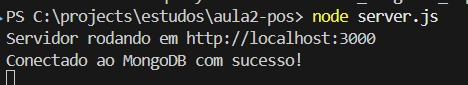
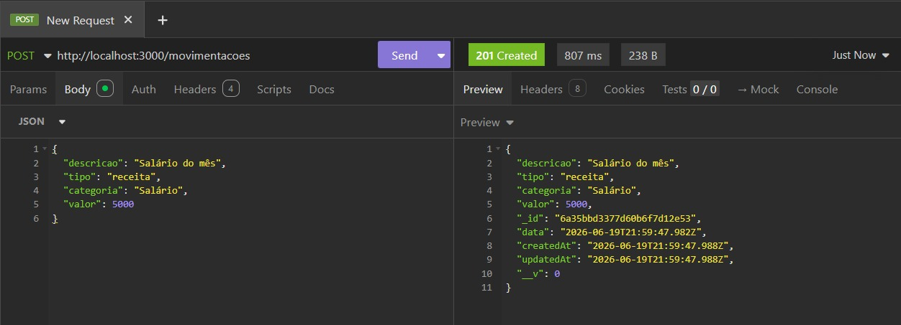
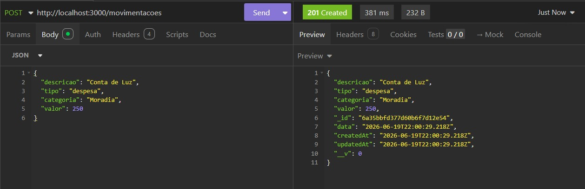
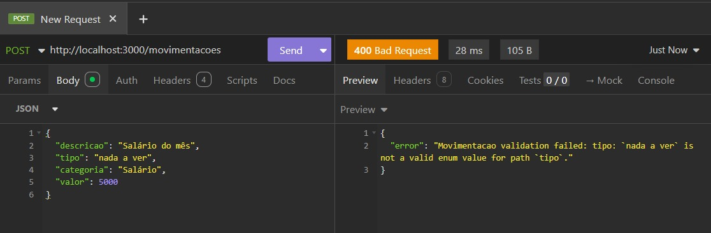
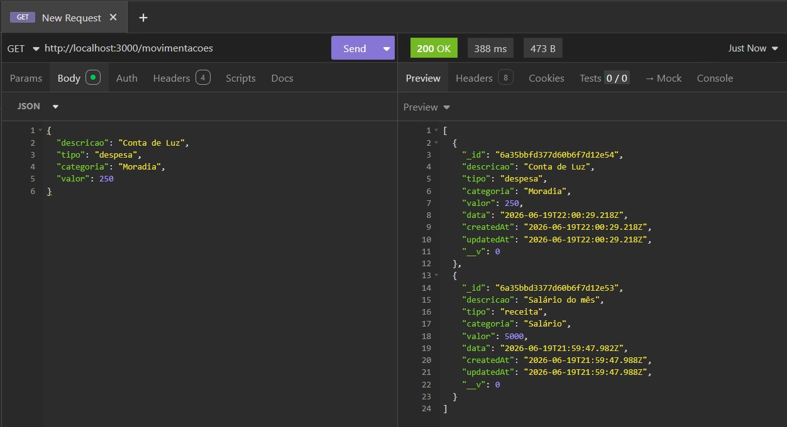
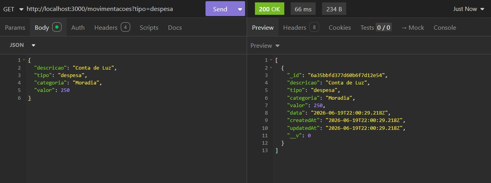
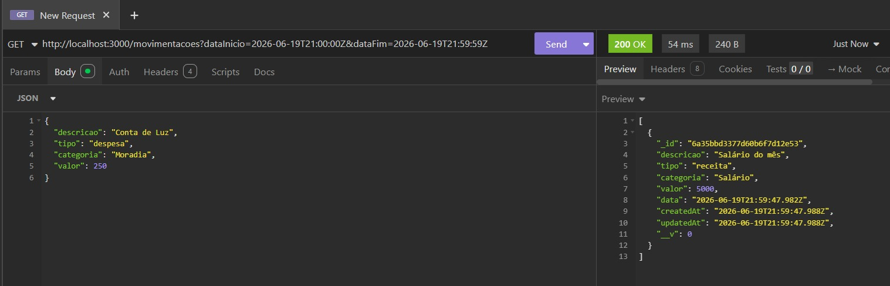
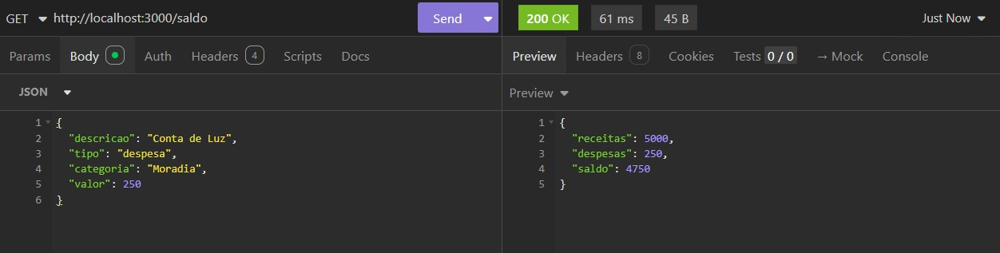
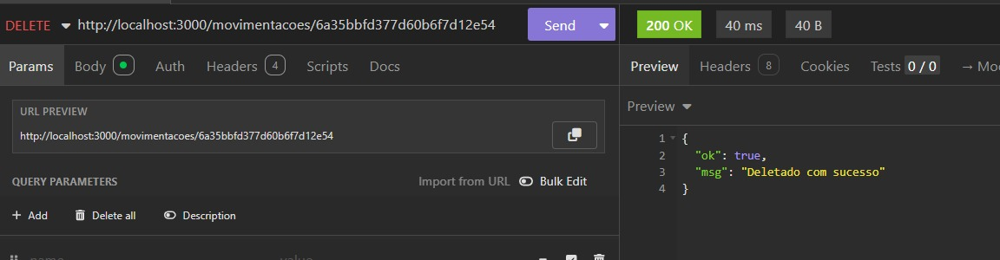

# Gestor Financeiro Pessoal - API REST

Este projeto consiste no desenvolvimento de uma API REST para controle financeiro pessoal, utilizando **Node.js** e **MongoDB**.

## Informações Acadêmicas
- **Aluno:** Ciano Meliunas da Silva (RA: 211963)
- **Professor:** Fabrício Tonetto Londero
- **Disciplina:** Arquitetura de Software - Full Stack (Pós Graduação)
- **Atividade:** Aula 2 - API Node.js com MongoDB

---

## 1. Conexão com Banco de Dados
A API utiliza o Mongoose para conectar-se ao MongoDB Atlas.

## 2. Testes de Cadastro (POST)
Foram realizados testes de inserção de registros (receitas e despesas), incluindo validação de dados.

## 3. Testes de Consulta (GET)
Testes realizados para listagem geral, filtragem por tipo, data e cálculo de saldo via agregação.

## 4. Testes de Deleção (DELETE)
Teste de exclusão de registros via ID.
